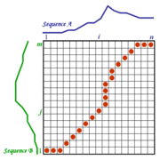
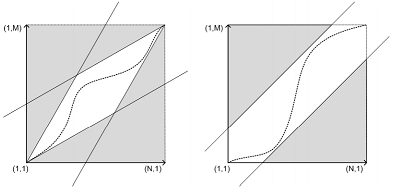
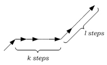
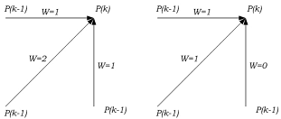
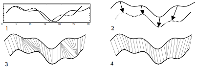

## 1. Introduction

The purpose of our project is to use dynamic programming for speech recognition. Our algorithm uses a dynamic time warping function to establish similarities between two sound waves. We took inspirations from the symmetric algorithm established in “Dynamic Programming Algorithm Optimization for Spoken Word Recognition” (Sakoe and Chiba), imposing several restrictions on the algorithm to improve performance. We test our algorithm on several common words such as “Google” and “Facebook”, taking sound waves from one of our group members. The algorithm is able to distinguish distinct words and is programmed to open a webpage of the recognized word. The algorithm can distinguish words in an efficient manner due to dynamic programming along with several restrictions discussed below.  
\
The code and sounds of this project can be found in our [Github Repository](https://github.com/ainalopez/SMO-Speech-Recognition)


&nbsp;
&nbsp;

## 2. Dynamic Time Warping

One of the difficulties in speech recognition is comparing different sound waves. The length of the sound waves almost never match, even if the words are spoken in the same manner. We use the term “sound waves” to describe the user-spoken words taken as input into our algorithm. Speech recognition algorithms run into problems if the sound waves are not aligned properly. To combat this issue, we use a dynamic time warping function to account for differences across sound waves. A dynamic time warping function takes into account differences in sound wave lengths, and finds an “optimal” path between the two sequences where they are most similar. Two types of time warping functions exist, asymmetric, where the time axis of one sound wave is transformed onto that of the other sound wave, and symmetric, where both waves are mapped to a newly defined common axis. We chose to implement a symmetric warping function due to its superior performance.  

## 2.1 Algorithm

The execution of the algorithm requires the creation of a matrix  whose rows correspond to one time series and the columns to the other, both starting at the bottom left. The elements of the matrix correspond to the distance between the values of the two time series. A path of this matrix specifies how the observations are matched, and its length is the sum of the distances between those points. The best match or alignment between these two sequences is a path of the matrix which minimizes the total distance between the two sequences. 

The algorithm is initalized with the parameter $r$, which squeezes the path in between the warping window. The algorithm then initializes the first point, in the bottom corner of the matrix. The algorithm computes the distances between the two time series from left to right working its way up the matrix, eventually stopping at the top right corner. From the right corner, it finds the path that takes the shortest distance from the top corner back to the bottom, giving us the path where the time series are most similar. 

In each step of the algorithm we apply the following dynamic equation to find the next match of the path.

$$
g(i,j)= Min
\begin{cases}
g(i,j-1) + d(i,j) \\
g(i-1,j) + d(i,j) \\
g(i-1,j-1) + d(i,j)
\end{cases}
$$

The plot below is an exmaple of an alingment path of two time series. 




## Restrictions on Warping Function


### Conditions

If we use the original DTW function we may overfit the alingment path. If we want this path to be smooth and stable we need to impose some conditions on the function. 

Path constraints are used as a way to improve the computational cost, and optimize DTW sensitivity. It could be performed in a couple of ways, for example, through Itakura parallelogram (pictured below on the left), or Sakoe-Chiba band (pictured below on the right).  


The following are the common conditions on path alingment:

- Monotonicity condition

This condition guarantees that the index does not jump over time, this is, the features are not repeated in the alingment. 
$i(k-1) \leq i(k)$ and $j(k-1) \leq j(k)$


- Continuity condition

This condition guarantees that the alingment does not omit some important features. 

$i(k-1) - i(k) \leq 1$ and $j(k-1) - j(k) \leq 1$

As a result of these two restriction, the following relation holds between two consecutive points:


$$
c(k-1)=
\begin{cases}
(i(k),j(k)-1) \\
(i(k)-1,j(k)) \\
(i(k)-1,j(k)-1)
\end{cases}
$$

- Boundary condition

This condition implies that the alingment path starts at the bottom left corner and ends at the top right corner. This guarantees that the alingment does not consider only one of the sequences. 

$i(1)=1, j(1)=1$ and $i(K)=I , j(K)=J$ 


- Adjust window condition

This condition forces the alingment path to be close to the diagonal. This ensures that the path does not skip features and gets stuck at some features.

$|i(k)-j(k)| \leq  r$

where $r$ is a positive integer called window length.

- Slope constraint condition

The slope constraint condition takes care of potentially unrealistic correspondence between the time-series features of different length, by introducing a constraint on each step and between consecutive points of the warping path. For example, after moving in the same direction horizontally for *k* consecutive points the warping path is not allowed to continue in the same direction before stepping *l* points in the diagonal direction. This condition prevents the very short parts of the sequences matching to the very long parts of the sequences. Below is a picture describing the constraint.  
 


### Weighting

We implement step weighting to help favour or penalize certain types of point-to-point correspondence. Both approaches, symmetric and asymmetric weighting, find successful implementation depending on the topic researched. Pictured below in the left figure we demonstrate symmetric weights, while in the right figure we demonstrate asymmetric weights.  
  
\


## 2.2 Modifications

### Derivative Dynamic Time Warping
Derivative DTW [1] proposes replacement of the value of each data point with its estimated local first derivation in the process of dynamic time warping. The improvement over the classic DTW is shown in the figure below, after creating 1) two artificial signals, and identifying 2) the intuitive feature to feature warping alignment, the alignment produced by classic DTW and the alignment produced by DDTW are sections 3) and 4) respectively.  


### Feature Based DTW and Adaptive Feature Based DTW

Comparing various implementations of DTW, the value or the deviation of a point may not reflect the position of this point in global or local trends of the sequence. Upon further research of the issue, Feature Based DTW and Adaptive Feature Based DTW by Xie and Wiltgen [2] are introduced.

Feature Based DTW algorithm works as follows: first the algorithm defines a global and local feature for each point in a time series sequence, then dynamically aligns the two time series sequences based on both the global and local features of each points in the sequences.
Adaptive Feature Based DTW enjoys the additional customization of Feature Based DTW where the contributions of global features and local features are leveraged by weighting factors.
Empirically, both methods enhance the learning capacity of DTW based classification algorithms while the advanced version goes the furthest in improvement.

### Cluster Generative Statistical DTW 

Multi-purpose classification problems that rely on the sequential type of data can have at its core a modified DTW algorithm. Here, Cluster Generative Statistical DTW [3] is described as a general, scalable, (hidden Markov modeling) based method for variable-sized, sequential data that holistically combines cluster analysis and statistical sequence modeling. One of its strength lies in initialization of the statistical warping framework. through defined DTW (Viterbi) distance.  


## 2.3 Applications

Dynamic Time Warping is used to analyze any data which can be turned into a linear sequence: video, audio, and graphics data alongside original time series data. DTW is often used in handwriting and online signature matching, sign language and gestures recognition, data mining and time series clustering, computer vision and computer animation, surveillance, protein sequence alignment and chemical engineering, along with signal processing.  

&nbsp;
&nbsp;

# 3. Speech Recognizer

We implemented a speech recognizer applying a modified version of the DTW algorithm. Using DTW and speech processing techniques (i.e. Mel Frequency Cepstral Coefficients), our algorithm is able to detect which action we want to perform: open the google search or open our facebook webpage.  

This speech recognizer takes as input a sound file and compares it with some template words: *google* and *facebook*. In order to make our recognizer more robust, we have used two template words for each sound. After comparing the input sound with each template word, the algorithm chooses the one with the shortest path, in other words, it chooses the word that is most similar.  


*Figure 1. Scheme of our speech recognizer .*

&nbsp;

## 3.1 Speech Processing

Since each sound has a different length, DTW is a good algorithm for comparing different sounds with different lengths. However, sound waves are sinusoids and cannot be properly compared on the time domain (amplitude vs seconds). The reason is simple, a sound wave of a word can change radically from person to person, and even the sound waves of a word generated by a single person can be very different.  

Looking at the sound waves of our examples, we can see their differences below.  


*Figure 2. Sound Waves of the word Google.*


*Figure 3. Sound Waves of the word Facebook.*   

&nbsp;

An extended approach is to transform the sound waves into the frequency domain and delete the unnecessary frequencies and extract some coefficients ([3], [4]). In this project, we tried with two different coefficients: Mel Frequency Cepstral Coefficients (MFCC) and Linear Prediction Coefficient (LPC). Unfortunately, we didn't obtained good results with LPC and we decided to use MFCC.  
An extended approach is to transform the sound waves into the frequency domain and delete the unnecessary frequencies while extracting some coefficients ([4], [5]). In this project, we tried with two different coefficients: Mel Frequency Cepstral Coefficients (MFCC) and Linear Prediction Coefficient (LPC). Unfortunately, we didn't obtained good results with LPC and we decided to use only MFCC.  
\
\

**1. Pre-emphasizing**: In order to digitalize audio, we must send it through a low-pass filter and reduce the high frequencies. In this step, a pre-emphasizing filter is applied to emphazise the higest frequenciy components of the speech, in an effort to increase the energy in the higher frequencies.

$$
y(n) = x(n) - 0.95 x(n-1)
$$


**2. Framing**: From the above plots, we can clearly see that sound signals are not stationary. However, we can assume that if we take a small sample called frame (approximately of 10ms or 20 ms) then this sample will be stationary. We created a set of frames of 16ms.  
\
\

**3. Windowing**: In order to make the transition between frames smoother, a window is multiplied with each frame. The most used window for speech procesing is a *Hamming Window*:

$$
w(n) = 0.54 - cos( \frac{2 \pi n}{N-1})
$$  

where N is the length of the window, in this case the length of the frame.  
\
\

**4. Mel Frequency Cepstral Coefficient (MFCC)**: Mel scale is based on human perception of frequencies. The basic idea of MFCC is to only keep the most relevant frequencies and ignore the others. The process is the following:

1. Convert the frames into the frequency domain using the Discrete Fourier Transform (DFT).  

2. Apply the Mel Scale filter bank, which is a set of triangular filters, and take the logarithm.  

3. Finally, transform the results into the time domain again using the Discrete Cosine Transform (DCT).

From this process we obtain K coefficients, in our case K = 11.  
\
At the end, we end up having M frames and each frame contains a vector of 11 coefficients.  

&nbsp;
&nbsp;

## 3.2 Dynamic Time Warping in this project  

We created a function in R that takes as an input two matrices and a parameter *w*. These two matrices are the result of the speech transformation explained above. The parameter *w* corresponds to the adjusting window condition, and we gave it a default value of 4. We used this function to predict whether a new sound wave corresponds to the word "google" or "facebook". 

In order to predict the category of a new sound, we use our function to compare it to all our existing sound waves. This gives us the value of the shortest path between our new sound and the rest of samples. At this point, if the shortest of these values corresponds to "google", we classify the new sound as "google". Similarly, if that path corresponds to "facebook", we classify it as "facebook". If we had many samples, we could take *k* closest samples and take a majority vote to predict the category of the new sound.  

&nbsp;
&nbsp;

## 3.3 Results

In order to test the accuracy of our speech recognizer, we recorded and evaluated the recognizer using our voices.

* Our four template sounds were created by the same male voice: facebook1.wav, facebook2.wav, google1.wav, google2.wav.  

* We created two new samples for each word using the same male voice. Those files are facebook3.wav, facebook4.wav, google3.wav, google4.wav. 

* Finally, we recorded two new samples for the word *facebook* using a different male (facebookY.wav) and a female (facebookA.wav) voices. 

After using our R function to compare the new samples with the previous ones we correctly predicted both categories. The detailed results that we obtained are summarized in the following tables. Each column represents one template sound and each row is the name of the file used to test. The result showed is the estimated distance between each pair of sounds.  
\
\

**Same voice in the test than in the templates**


 Test File   | Google1.wav | Google2.wav | Facebook1.wav | Facebook2.wav  
-------------|-------------|-------------|---------------|---------------
Google3.wav  | 1912.219    | 1915.605    | 2777.309      | 3276.481
Google4.wav  | 2557.622    | 2013.829    | 2611.561      | 3634.220
Facebook3.wav     | 3258.776    | 3640.018    | 2231.563      | 1248.368
Facebook4.wav     | 3500.642    | 3697.621    | 1678.746      | 1214.219

\pagebreak 

**Different Voices (male Y and female A)**

Test File  | Google1.wav | Google2.wav | Facebook1.wav | Facebook2.wav  
-------------------|-------------|-------------|---------------|---------------
FacebookA.wav      | 2913.051    | 2915.692    | 2004.277      | 2059.823
FacebookY.wav      | 4070.689    | 3705.251    | 1976.636      | 2247.728


The minimum distances correspond to the the same word in all cases. This shows that dynamic time warping performs well when dealing with speech recognition. Unfortunately, we don't have enough data to claim that it will always work.  
\
In the figure below we can observe some warping paths. 


*Figure 4. Warping Paths of one of our examples. Red lines represent the warping path between two different words and green lines represent the warping path between same words.*  

&nbsp;

Additionally, the DTW algorithm is very fast on our examples, taking approximately 0.09 seconds on the data we gave it.  

This process could be applied in an application where the user can open a program just by saying its name.

&nbsp;
&nbsp;

# 4. Conclusions

* We found our dynamic time warping function performed fast and accurately, however there is room for improvement. Our algorithm works well on individual words, however it remains untested on sentences.

* We found that our algorithm works for both male and female voices. Thanks to MFCC, we are able to extract the important frequencies and eliminate the others, creating a recognizer robust to gender. 

* In the near future we would like more template data to make our algorithm more robust. We would like to test our algorithm on more voices, but with the limited data we had, we are not able to make universal claims at this time. 

* From R, we were not able to import voices in real time, however this would add a unique capability to our algorithm. 


&nbsp;
&nbsp;


# 5. References 

[1] Keogh, E. J., & Pazzani, M. J. [Derivative Dynamic Time Warping](http://www.ics.uci.edu/~pazzani/Publications/keogh-kdd.pdf)

[2] Xie, Y. & Wiltgen, B. [Adaptive Feature Based Dynamic Time Warping](http://paper.ijcsns.org/07_book/201001/20100135.pdf)

[3] Anand, D. A., & Meher, P. K. [Combined LPC and MFCC Features based technique for Isolated Speech Recognition.](http://www-personal.umich.edu/~aniketde/ISCAS2013_paper.pdf) 

[4] Shinde, M. R., & Pawar, V. P. [Dynamic time Warping using MATLAB & PRAAT.](http://www.ijser.org/researchpaper%5CDynamic-time-Warping-using-MATLAB-PRAAT.pdf) 


\pagebreak

# 6. Annex

## 6.1 DTW function 

```{r,echo = TRUE, eval = FALSE}
TimeWarp<-function(x,y,w=4){
  
  # define distance function
  distance<-function(a,b){
    dist(rbind(a,b))
    }
  
  # 1. Compute matrix 11xM
  
  # set parameters
  m<-dim(x)[2]
  n<-dim(y)[2]
  colnames(x)<-1:m
  colnames(y)<-1:n
  w = max(w, abs(n-m))
  
  # Create matrix
  DTW<-matrix(Inf,n,m)
  rownames(DTW)<-n:1
  colnames(DTW)<-1:m
  
  # Initial values
  DTW['1','1']<-distance(x[,'1'], y[,'1'])

   # First row
  for(j in 2:(w+1)){
    cost<-distance(x[,as.character(j)], y[,as.character(1)])
    DTW['1',as.character(j)]<- cost + DTW['1', as.character(j-1)]
  }
  
   # First column
  for(i in 2:(w+1)){
    cost<-distance(x[,as.character(1)],y[,as.character(i)])
    DTW[as.character(i), '1']<- cost + DTW[as.character(i-1), '1']
  }
  
  # Fill matrix
  for(i in 2:n){
    for(j in (max(2, i-w)):(min(m, i+w))){
      
      #current cost
      cost<-distance(x[,as.character(j)], y[,as.character(i)])
      
      #cumulated cost
      d.cost<-min(DTW[as.character(i-1), as.character(j)] ,
                        DTW[as.character(i), as.character(j-1)], 
                        2*DTW[as.character(i-1), as.character(j-1)])
            
      #combined cost
      DTW[as.character(i),as.character(j)]<-cost + d.cost
    
    }
  }

  # 2. Find path
  path<-matrix(c(n,m), 1,2)
  full.path<-(tail(path,1)[1] ==1 & tail(path,1)[2] ==1)   
  
  while(full.path==FALSE ){
  
    l.path<-tail(path,1)
    
    if(l.path[1]==1 | l.path[2]==1){
      p<-which(l.path==1)
        
          if(p==1){new.point<-c(l.path[1], l.path[2]-1)
           }else{
            new.point<-c(l.path[1]-1, l.path[2])
      }
      
    } else {
    
    # nearest point
    min.step<-min(DTW[as.character(l.path[1]-1), as.character(l.path[2]-1)],
        DTW[as.character(l.path[1]), as.character(l.path[2]-1)],
        DTW[as.character(l.path[1]-1), as.character(l.path[2])])
    min.step<-which(c(DTW[as.character(l.path[1]-1), as.character(l.path[2]-1)],
                    DTW[as.character(l.path[1]), as.character(l.path[2]-1)],
                    DTW[as.character(l.path[1]-1), as.character(l.path[2])])==min.step)
    min.step<-min.step[1]
    
    #path to nearest point
    if(min.step==1){
      new.point<-c(l.path[1]-1, l.path[2]-1)
    } else{
      if(min.step==2){
      new.point<-c(l.path[1], l.path[2]-1)
      } else{
        new.point<-c(l.path[1]-1, l.path[2])  
      }
    }
    }
    path<-rbind(path,new.point)
    full.path<-(tail(path,1)[1] ==1 & tail(path,1)[2] ==1)   
    
    }
  

return(list(path=path, DTW=DTW))
}
```


## 6.2 Speech Recognizer code

```{r, echo = TRUE, eval = FALSE}
# input: isound is the path to the wav file with the sound.

SpeechRecognizer <- function(isound){

  if (!require("tuneR")) install.packages("tuneR");library(tuneR)
  
  
  # Read the wav file
  sound <- readWave(isound)
  sr    <- sound@samp.rate
  
  # Compute the mel frequency cepstrum coefficients
  inputWord <- t(melfcc(sound, 
                        sr, 
                        wintime=0.016, 
                        lifterexp=0, 
                        minfreq=133.33,
                        maxfreq=6855.6, 
                        sumpower=FALSE))
  
  # Upload the four template sounds and compute their melfcc
  g1 <- readWave("Project/google1.wav")
  g2 <- readWave("Project/google2.wav")
  f1 <- readWave("Project/facebook1.wav")
  f2 <- readWave("Project/facebook2.wav")
  
  sr1 <- g1@samp.rate
  sr2 <- g2@samp.rate
  sr3 <- f1@samp.rate
  sr4 <- f2@samp.rate
  
  google1 <- t(melfcc(g1, sr1, wintime=0.016, lifterexp=0, 
                      minfreq=133.33, maxfreq=6855.6, sumpower=FALSE))
  google2 <- t(melfcc(g2, sr2, wintime=0.016, lifterexp=0, 
                      minfreq=133.33, maxfreq=6855.6, sumpower=FALSE))
  facebook1 <- t(melfcc(f1, sr3, wintime=0.016, lifterexp=0, 
                        minfreq=133.33, maxfreq=6855.6, sumpower=FALSE))
  facebook2 <- t(melfcc(f2, sr4, wintime=0.016, lifterexp=0, 
                        minfreq=133.33, maxfreq=6855.6, sumpower=FALSE))
  
  
  # Compute the distance of the input sound with the template sounds
  distance.sound<-rep(NA, 4)

  dtwg1 <- TimeWarp(google1, inputWord)
  distance.sound[1]<- tail(dtwg1$DTW[1,],1)

  dtwg2 <- TimeWarp(google2, inputWord)
  distance.sound[2]<- tail(dtwg2$DTW[1,],1)
   
  dtwf1 <- TimeWarp(facebook1, inputWord)
  distance.sound[3]<- tail(dtwf1$DTW[1,],1)
  
  dtwf2 <- TimeWarp(facebook2, inputWord)
  distance.sound[4]<- tail(dtwf2$DTW[1,],1)
  
  
  # If the minimum distance is to the word gmail, open gmail
  if (which.min(distance.sound) == 1 | which.min(distance.sound) == 2){
    system(paste("open http://google.com"))
  } 
  
   # If the minimum distance is to the word facebook, open facebook
  if (which.min(distance.sound) ==3 | which.min(distance.sound) == 4){
     system(paste("open http://facebook.com"))
  } 
}
```